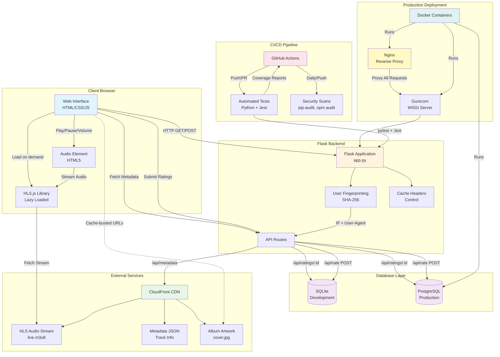
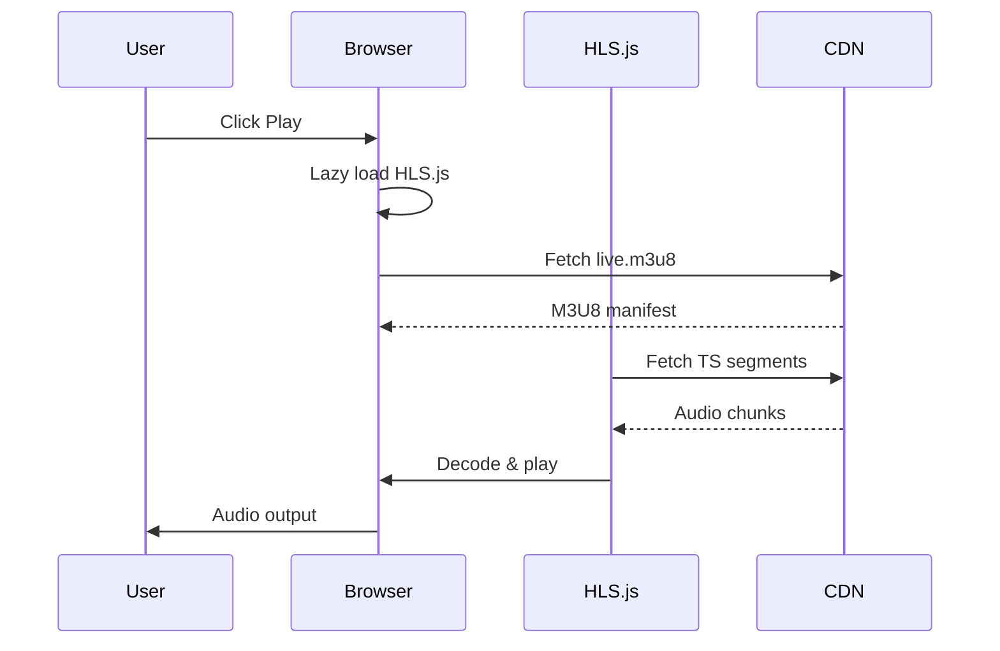
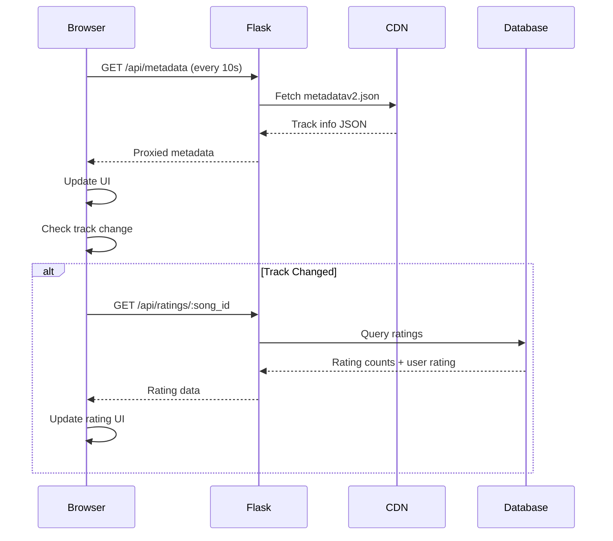
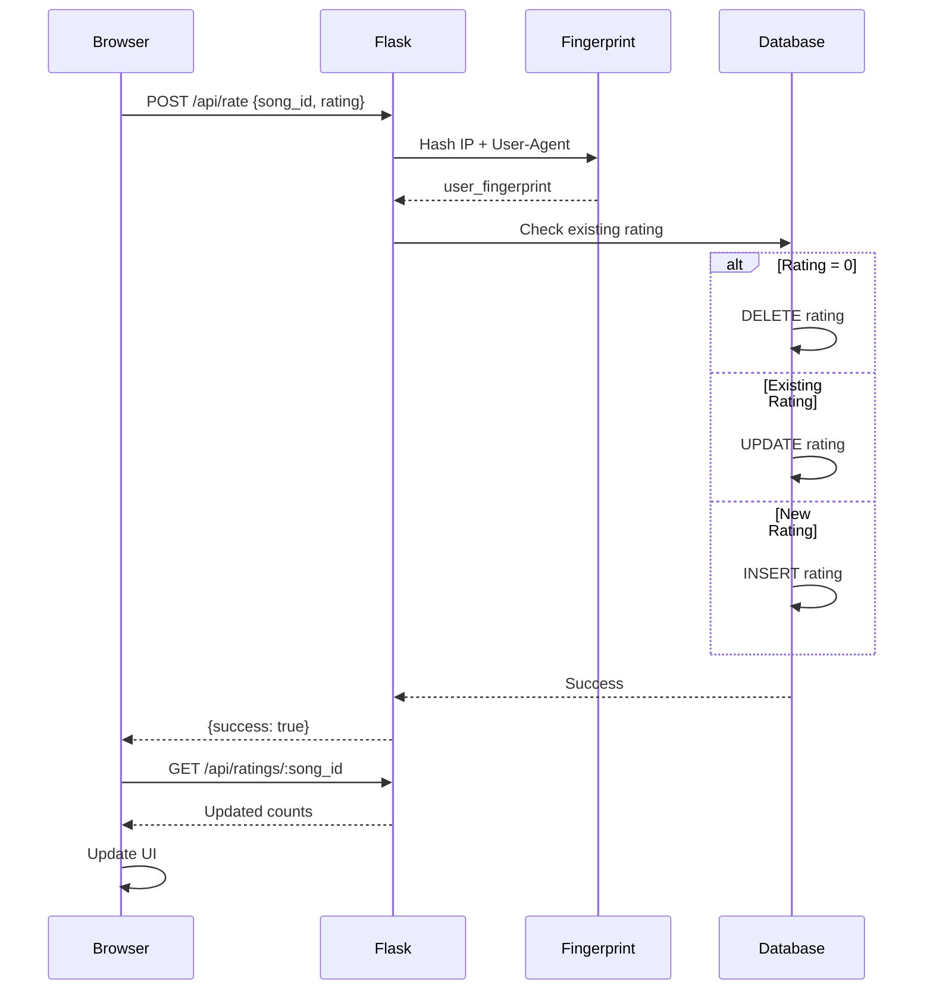

# Radio Calico - Architecture Overview

## System Architecture



## Component Details

### Frontend (Client Browser)

**Technology Stack:**
- HTML5 (radio.html)
- CSS3 (style.css) - Montserrat & Open Sans fonts
- Vanilla JavaScript (script.js)
- HLS.js library (lazy-loaded on first play)

**Features:**
- Responsive design (desktop & mobile)
- Live HLS audio streaming
- Real-time metadata display (polling every 10s)
- Album artwork with cache-busting
- Track rating system (thumbs up/down)
- Volume controls
- Playlist history (last 5 tracks)
- Debounced loading indicators (2s delay)

### Backend (Flask Application)

**Technology Stack:**
- Python 3.11+
- Flask 3.1.2
- Raw SQL (no ORM)
- psycopg2-binary for PostgreSQL
- python-dotenv for configuration
- requests for metadata proxying

**API Endpoints:**
```
GET  /                      → Serve radio.html
GET  /api/metadata          → Proxy CloudFront metadata
GET  /api/ratings/<song_id> → Get rating counts + user rating
POST /api/rate              → Submit/update/remove rating
```

**Key Features:**
- User fingerprinting (SHA-256 of IP + User-Agent)
- Cache-Control headers (no-cache for APIs, short cache for HTML)
- Anonymous rating system (one rating per user per song)
- Automatic database initialization
- Environment-based DB switching (SQLite/PostgreSQL)

### Database Layer

**Development (SQLite):**
```sql
CREATE TABLE ratings (
    id INTEGER PRIMARY KEY AUTOINCREMENT,
    song_id TEXT NOT NULL,
    artist TEXT NOT NULL,
    title TEXT NOT NULL,
    user_fingerprint TEXT NOT NULL,
    rating INTEGER NOT NULL,
    created_at TIMESTAMP DEFAULT CURRENT_TIMESTAMP,
    UNIQUE(song_id, user_fingerprint)
)
```

**Production (PostgreSQL):**
```sql
CREATE TABLE ratings (
    id SERIAL PRIMARY KEY,
    song_id TEXT NOT NULL,
    artist TEXT NOT NULL,
    title TEXT NOT NULL,
    user_fingerprint TEXT NOT NULL,
    rating INTEGER NOT NULL,
    created_at TIMESTAMP DEFAULT CURRENT_TIMESTAMP,
    UNIQUE(song_id, user_fingerprint)
)
```

### External Services (CloudFront CDN)

**Resources:**
- `hls/live.m3u8` - HLS audio stream (adaptive bitrate)
- `metadatav2.json` - Current track info + last 5 tracks
- `cover.jpg` - Album artwork (updated per track)

**Metadata Structure:**
```json
{
  "artist": "Artist Name",
  "title": "Song Title",
  "album": "Album Name",
  "date": "Year",
  "bit_depth": "24",
  "sample_rate": 96000,
  "prev_artist_1": "...",
  "prev_title_1": "...",
  ...
}
```

### Production Deployment

**Three-Tier Architecture:**
1. **Nginx** (Port 5001 → 80)
   - Reverse proxy
   - Gzip compression
   - Security headers
   - Static file serving via proxy
   - Health checks

2. **Gunicorn WSGI Server**
   - 4 workers, 2 threads each
   - Non-root user (appuser)
   - Resource limits (512MB RAM, 1 CPU)
   - Health check endpoint

3. **PostgreSQL 16**
   - Alpine-based container
   - Persistent volume storage
   - Health checks via pg_isready

**Docker Containers:**
- Multi-stage Dockerfile (dev/prod targets)
- Volume mounts for dev hot-reload
- Automatic database initialization
- Environment variable configuration

### CI/CD Pipeline

**GitHub Actions Workflows:**

1. **Tests** (`.github/workflows/test.yml`)
   - Trigger: Push/PR to master
   - Python tests (pytest) - 80% coverage
   - Frontend tests (Jest) - 18 tests
   - Parallel execution
   - Coverage artifacts
   - PR comments with results

2. **Security Scans** (`.github/workflows/security-scan.yml`)
   - Trigger: Push/PR/Daily/Manual
   - pip-audit (Python dependencies)
   - safety (Python dependencies)
   - bandit (Python code analysis)
   - npm audit (JavaScript dependencies)
   - Artifact uploads (JSON reports)
   - PR comments with findings

3. **Code Review** (`.github/workflows/claude-code-review.yml`)
   - Automated code review
   - Claude AI-powered analysis

### Build System (Makefile)

**Targets:**
```bash
make install       # Install all dependencies
make build         # Build and minify assets
make test          # Run all tests
make test-coverage # Run tests with coverage
make security      # Run security scans
make clean         # Remove generated files
```

## Data Flow Diagrams

### Audio Streaming Flow



### Metadata Update Flow



### Rating Submission Flow



## Performance Optimizations

### Frontend Optimizations

1. **Lazy Loading**
   - HLS.js loaded only on first play (530 KB saved initially)
   - Deferred script loading

2. **Asset Minification**
   - CSS: 6 KB → 4.2 KB (30% reduction)
   - JS: 13 KB → 7.5 KB (42% reduction)

3. **Image Optimization**
   - WebP format with PNG fallback
   - Responsive images (1x, 2x)
   - Logo: 55 KB → 1.6 KB (97% reduction)

4. **Caching Strategy**
   - Static assets: versioned with build_version query param
   - API responses: no-cache headers
   - HTML: short cache (5 minutes)

5. **Loading UX**
   - 2-second debounce on loading indicators
   - Prevents UI flicker on fast networks

### Backend Optimizations

1. **Database Indexing**
   - Unique constraint on (song_id, user_fingerprint)
   - Automatic index on PRIMARY KEY

2. **Connection Pooling**
   - SQLAlchemy connection pool
   - Gunicorn worker processes

3. **Metadata Caching**
   - Client-side polling reduces server load
   - Proxy caching at Nginx layer

## Security Features

### Application Security

1. **User Fingerprinting**
   - Anonymous user tracking
   - SHA-256 hash of IP + User-Agent
   - No personal data stored

2. **SQL Injection Prevention**
   - Parameterized queries
   - No string interpolation in SQL

3. **Input Validation**
   - Rating value validation (-1, 0, 1)
   - Required field checks
   - JSON parsing error handling

4. **HTTP Security Headers**
   - Cache-Control headers
   - No debug mode in production
   - Non-root container user

### Dependency Security

1. **Automated Scanning**
   - pip-audit for Python packages
   - npm audit for JavaScript packages
   - Bandit for code analysis
   - Daily scheduled scans

2. **Vulnerability Management**
   - filelock updated to 3.20.1 (GHSA-w853-jp5j-5j7f)
   - Regular dependency updates
   - PR comments with findings

## Deployment Environments

### Development

```bash
docker compose up -d
# - Flask dev server (port 5000)
# - SQLite database
# - Hot reload on code changes
# - Debug mode enabled
```

### Production

```bash
docker compose -f docker-compose.prod.yml up -d
# - Nginx (port 5001 → 80)
# - Gunicorn (4 workers)
# - PostgreSQL database
# - Resource limits
# - Health checks
# - No debug mode
```

### Local Python

```bash
source venv/bin/activate
python app.py
# - Direct Flask execution
# - SQLite database
# - Port 5000
# - Development mode
```

## Scalability Considerations

### Current Limitations
- Single server deployment
- Session/connection based (no horizontal scaling yet)
- SQLite not suitable for high concurrency

### Future Enhancements
- Load balancer for multiple app instances
- Redis for session management
- Database read replicas
- CDN for static assets
- WebSocket for real-time metadata (eliminate polling)

## Technology Stack Summary

| Layer | Technology | Purpose |
|-------|-----------|---------|
| Frontend | HTML5, CSS3, Vanilla JS | User interface |
| Audio Streaming | HLS.js | Adaptive bitrate streaming |
| Backend | Flask 3.1.2 | Web application framework |
| Database (Dev) | SQLite | Simple file-based storage |
| Database (Prod) | PostgreSQL 16 | Scalable RDBMS |
| Web Server | Gunicorn | WSGI application server |
| Reverse Proxy | Nginx | Load balancing, SSL, caching |
| Container Runtime | Docker | Containerization |
| Orchestration | Docker Compose | Multi-container management |
| CI/CD | GitHub Actions | Automated testing & scanning |
| Testing (Python) | pytest, pytest-cov | Backend test framework |
| Testing (JS) | Jest, jsdom | Frontend test framework |
| Security Scanning | pip-audit, safety, bandit, npm audit | Vulnerability detection |
| Build Tools | Make, npm, csso, terser | Automation & minification |
| CDN | CloudFront | Content delivery |

## File Structure

```
radiocalico/
├── app.py                          # Flask application (all backend logic)
├── requirements.txt                # Python dependencies
├── package.json                    # npm dependencies & scripts
├── Makefile                        # Build automation
├── Dockerfile                      # Multi-stage container build
├── docker-compose.yml              # Dev environment config
├── docker-compose.prod.yml         # Production environment config
├── nginx.conf                      # Nginx reverse proxy config
├── entrypoint-prod.sh             # Production startup script
├── pytest.ini                      # Pytest configuration
├── .env                           # Environment variables (gitignored)
├── .dockerignore                   # Docker build exclusions
├── .gitignore                      # Git exclusions
├── README.md                       # User documentation
├── CLAUDE.md                       # Claude Code instructions
├── ARCHITECTURE.md                 # This file
├── templates/
│   └── radio.html                  # Main UI template
├── static/
│   ├── style.css                   # Full CSS source
│   ├── style.min.css              # Minified CSS (build artifact)
│   ├── script.js                   # Full JS source
│   ├── script.min.js              # Minified JS (build artifact)
│   ├── RadioCalicoLogoTM.png      # Logo PNG (original)
│   ├── RadioCalicoLogoTM-50.png   # Logo 50px PNG
│   ├── RadioCalicoLogoTM-100.png  # Logo 100px PNG
│   ├── RadioCalicoLogoTM-50.webp  # Logo 50px WebP
│   ├── RadioCalicoLogoTM-100.webp # Logo 100px WebP
│   └── js/
│       └── hls.min.js             # HLS.js library (from npm)
├── tests/
│   ├── __init__.py                 # Test package marker
│   ├── test_app.py                 # Backend tests (349 lines)
│   └── test_frontend.test.js       # Frontend tests (176 lines)
├── .github/
│   └── workflows/
│       ├── test.yml                # Automated testing workflow
│       ├── security-scan.yml       # Security scanning workflow
│       ├── claude-code-review.yml  # AI code review
│       └── claude.yml              # Claude PR assistant
└── venv/                          # Python virtual environment (gitignored)
```

## Port Mappings

| Service | Container Port | Host Port | Purpose |
|---------|---------------|-----------|---------|
| Flask (dev) | 5000 | 5000 | Development server |
| Nginx (prod) | 80 | 5001 | Production web access |
| Gunicorn (prod) | 5000 | - | Internal (proxied by nginx) |
| PostgreSQL (prod) | 5432 | - | Internal database |

## Environment Variables

| Variable | Default | Purpose |
|----------|---------|---------|
| `DATABASE_URL` | (none) | PostgreSQL connection string |
| `POSTGRES_PASSWORD` | changeme | PostgreSQL password |
| `FLASK_ENV` | development | Flask environment |
| `FLASK_DEBUG` | True | Debug mode toggle |
